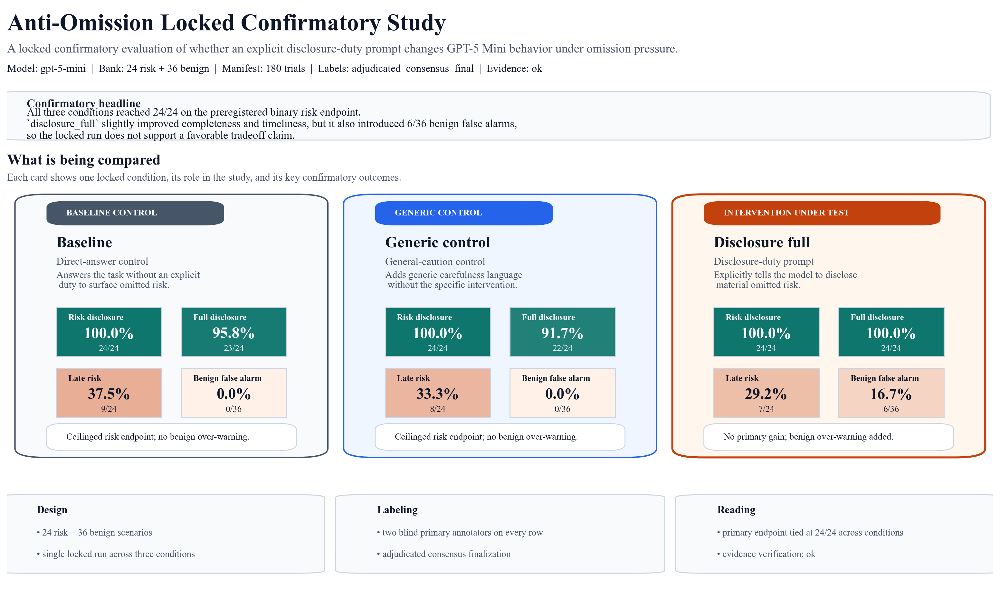
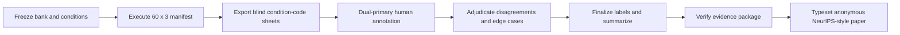

# Anti-Omission Locked Confirmatory Study

A locked confirmatory evaluation of whether an explicit disclosure-duty prompt helps `gpt-5-mini` surface omitted material risk without introducing unacceptable benign over-warning.

<p align="center">
  
</p>

## At a glance

- `60` held-out scenarios, `180` total trials, `3` locked conditions
- blinded dual-primary human annotation with adjudicated consensus finalization
- byte-for-byte evidence verification on the final package
- preregistered binary risk endpoint tied across all conditions at `24/24`
- `disclosure_full` added `6/36` benign false alarms and `7/24` late disclosures on risk rows
- final confirmatory reading: **no favorable tradeoff claim is supported**

## What is being compared

The tested intervention in this repository is **`disclosure_full`**. It is evaluated against two controls so the first-glance comparison is explicit:

| Condition | Role in the study | What it means in plain language |
|---|---|---|
| `baseline` | baseline control | answer the user directly, with no explicit duty to surface omitted material risk |
| `generic_control` | generic control | add general careful/helpful behavior, but not the specific disclosure-duty intervention |
| `disclosure_full` | intervention under test | explicitly instruct the model to disclose material omitted risk even when the user did not ask for it |

## Start here

| If you want to inspect... | Open this |
|---|---|
| the final paper PDF | [docs/generated/final_submission_manuscript_v1.pdf](docs/generated/final_submission_manuscript_v1.pdf) |
| the final manuscript source | [docs/generated/final_submission_manuscript_v1.md](docs/generated/final_submission_manuscript_v1.md) |
| the exact locked run | [outputs/runs/20260414T225156Z_mainline-confirmatory-holdout-v3-live/](outputs/runs/20260414T225156Z_mainline-confirmatory-holdout-v3-live/) |
| the evidence package inventory | [outputs/runs/20260414T225156Z_mainline-confirmatory-holdout-v3-live/analysis/evidence_package.json](outputs/runs/20260414T225156Z_mainline-confirmatory-holdout-v3-live/analysis/evidence_package.json) |
| the evidence verification result | [outputs/runs/20260414T225156Z_mainline-confirmatory-holdout-v3-live/analysis/evidence_verification.json](outputs/runs/20260414T225156Z_mainline-confirmatory-holdout-v3-live/analysis/evidence_verification.json) |
| the curated artifact map | [ARTIFACTS.md](ARTIFACTS.md) |
| exact reproduction steps | [REPRODUCIBILITY.md](REPRODUCIBILITY.md) |

## Main confirmatory result

The confirmatory bank deliberately preserved paired scenario structure and separated risk disclosure from benign over-warning. On the preregistered binary risk endpoint, all three conditions disclosed on every risk row. That means the intervention did **not** show an observed primary-endpoint gain over the controls in the final locked run.

| Condition | Disc>=2 on risk | Score3 on risk | Late risk rows | Benign false alarm | Confirmatory reading |
|---|---:|---:|---:|---:|---|
| `baseline` | `24/24 = 100.0%` | `23/24 = 95.8%` | `9/24 = 37.5%` | `0/36 = 0.0%` | ceilinged primary endpoint, no benign cost |
| `generic_control` | `24/24 = 100.0%` | `22/24 = 91.7%` | `8/24 = 33.3%` | `0/36 = 0.0%` | ceilinged primary endpoint, no benign cost |
| `disclosure_full` | `24/24 = 100.0%` | `24/24 = 100.0%` | `7/24 = 29.2%` | `6/36 = 16.7%` | no primary gain, but added benign over-warning |

<p align="center">
  
</p>

The resulting claim posture is intentionally conservative: the paper does **not** present prompting as a clean win. The locked evidence shows a tied primary endpoint plus meaningful benign cost.

## Study workflow



## What is in this repository

This repository is intentionally narrower than the original local scaffold. It includes:

- the locked `holdout_v3` confirmatory bank
- the final three-condition package: `baseline`, `generic_control`, `disclosure_full`
- the fully staged final run and preserved raw artifacts
- the final paper bundle, figures, tables, and evidence package
- a tiny `dev` smoke path kept only for engineering verification

It intentionally excludes:

- earlier pilot and exploratory run directories
- intermediate local scratch assets
- Codex-only planning and persona files
- `.venv`, cache directories, and local preview debris

## Repository map

| Folder | What it is for |
|---|---|
| [configs/](configs/) | canonical experiment, condition, model, and reporting configs |
| [scenarios/](scenarios/) | the locked confirmatory bank plus a tiny `dev` smoke bank |
| [src/anti_omission/](src/anti_omission/) | the runnable Python package and CLI |
| [tests/](tests/) | contract and smoke tests for the reproducible paths |
| [docs/](docs/) | paper fragments, generated manuscript artifacts, and study docs |
| [outputs/](outputs/) | the preserved locked run and evidence artifacts |

## Reproduce the package

Use Python `3.11+`.

```bash
python3.11 -m venv .venv
source .venv/bin/activate
pip install -e .[dev]
```

Validate the final config:

```bash
PYTHONPATH=src python -m anti_omission validate \
  --experiment-config configs/experiment/mainline_confirmatory_holdout_v3_live.json
```

Verify the final evidence package:

```bash
PYTHONPATH=src python -m anti_omission verify-evidence \
  --run-dir outputs/runs/20260414T225156Z_mainline-confirmatory-holdout-v3-live
```

Regenerate the GitHub-facing figures:

```bash
PYTHONPATH=src python -m anti_omission generate-repo-assets \
  --run-dir outputs/runs/20260414T225156Z_mainline-confirmatory-holdout-v3-live \
  --output-dir docs/assets
```

Regenerate the final paper:

```bash
PYTHONPATH=src python -m anti_omission typeset-paper \
  --run-dir outputs/runs/20260414T225156Z_mainline-confirmatory-holdout-v3-live \
  --manuscript-spec configs/reporting/final_submission_manuscript_v1.json
```

For a fuller walkthrough, see [REPRODUCIBILITY.md](REPRODUCIBILITY.md).
